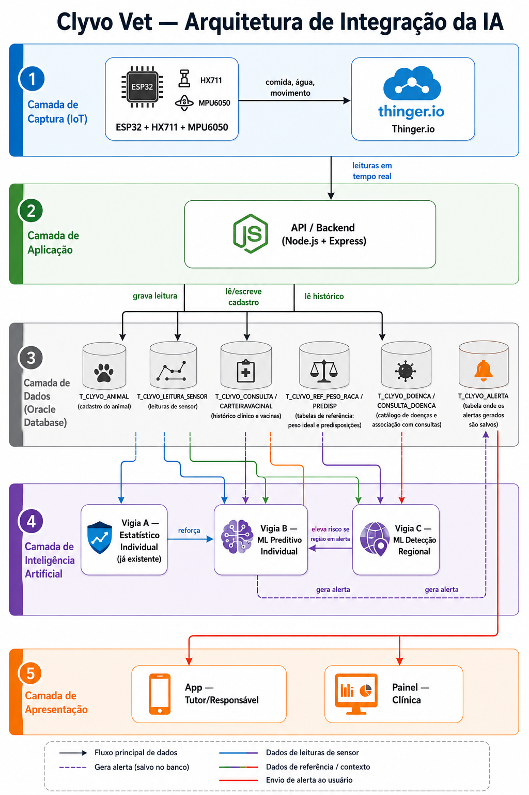

# Clyvo Vet — Componente de Inteligência Artificial

> Sistema de gestão veterinária centralizada para acompanhamento contínuo da 
> saúde de animais, utilizando IoT, IoB & Generative IA

## Sumário

1. [Visão geral](#1-visão-geral)
2. [Problema de negócio](#2-problema-de-negócio)
3. [Abordagem de IA escolhida e justificativa técnica](#3-abordagem-de-ia-escolhida-e-justificativa-técnica)
4. [Estratégia de personalização, priorização, recomendação de serviços e apoio à decisão](#4-estratégia-de-personalização-priorização-recomendação-de-serviços-e-apoio-à-decisão)
5. [Dados necessários: origem, estrutura e utilização](#5-dados-necessários-origem-estrutura-e-utilização)
6. [As 14 correlações de dados](#6-as-14-correlações-de-dados)
7. [Fluxo de dados entre usuários, aplicação, banco de dados e IA](#7-fluxo-de-dados-entre-usuários-aplicação-banco-de-dados-e-ia)
8. [Diagrama Arquitetural](#8-diagrama-arquitetural)
9. [Tecnologias utilizadas](#9-tecnologias-utilizadas)
10. [Status de implementação e resultados parciais](#10-status-de-implementação-e-resultados-parciais)
11. [Instruções de uso](#11-instruções-de-uso)

---

## 1. Visão geral

O objetivo da Clyvo é acompanhar a jornada contínua de saúde de animais, que infelizmente sofre com a falta de recorrência nos check-ups. Como os animais não conseguem comunicar o que estão sentindo, é comum que só sejam levados ao veterinário quando já estão realmente mal ou em situação de emergência, o que, sem um histórico de saúde estruturado, pode resultar em diagnósticos tardios.

A Clyvo Vet centraliza em um único lugar tudo o que um veterinário e uma clínica precisam no dia a dia para acompanhar seus pacientes: consultas, videoconsultas, emissão de notas, cadastro de pacientes e acompanhamento contínuo do animal. Para cada paciente, ficam disponíveis idade, peso, espécie, raça, carteira de vacinação, histórico de consultas, responsável e localização (inclusive quando o animal reside em endereço diferente do responsável), além da visão de consultas futuras, cancelamentos e remarcações. Para incentivar o retorno periódico, a plataforma envia lembretes automáticos por WhatsApp após um determinado intervalo desde a última consulta ou vacinação, permitindo ao responsável reagendar diretamente pela mensagem.

Além disso, um sistema de monitoramento IoT capta dados de movimentação, peso de alimento e água, e esses dados, junto aos dados cadastrais, alimentam um modelo de machine learning capaz de gerar alertas tanto para responsáveis quanto para a clínica/veterinários sobre possíveis problemas de saúde.

Também será implementado um sistema de controle sanitário, usando uma base de dados própria da Clyvo, que consiste em registrar, durante cada consulta, eventuais doenças diagnosticadas no cadastro daquele atendimento, vinculado ao animal e, por consequência, ao seu endereço/região. Esses registros alimentam uma base geográfica de ocorrências sanitárias: quando o número de casos de determinada doença em uma região ultrapassa um limite significativo, o sistema gera alertas automáticos para responsáveis e veterinários da área, além de alertas sazonais, cruzando dados históricos com períodos do ano em que certas doenças costumam ter maior incidência (ex: leptospirose em épocas de chuva). Assim, o Clyvo Vet une três camadas de dados, os comportamentais (IoT), os cadastrais e clínicos para atuar tanto na saúde individual do animal quanto na vigilância sanitária coletiva da região, fechando o ciclo entre prevenção, diagnóstico e monitoramento contínuo.

Na prática, isso significa que o Clyvo passa a contar com **três "vigias" diferentes** cuidando da saúde dos animais, cada um olhando pra uma coisa: um olha só o próprio animal, outro cruza isso com o perfil cadastrado e o terceiro olha a região inteira. A lógica detalhada de cada um desses três é apresentada na seção a seguir.

### Vigia A — Já existe, Fase 1 — IoT, sem Machine Learning

Compara a leitura atual do animal (comida, água, movimento) com a sua **própria média histórica**, calculando um **score de saúde de 0 a 100** em que a cada sinal anormal pontos são tirados. Esse resultado é classificado em quatro estados:

| Score | Estado | 
|---|---|
| > 85 | Normal |
| 66–85 | Atenção |
| 36–65 | Preocupante |
| 0–35 | Crítico |

> **Exemplo:** o cachorro do João sempre bebe cerca de 300ml de água por dia. Hoje ele bebeu só 150ml, ou seja, uma queda de 50% em relação ao normal *dele*, o que gera penalidade no score e pode levar o estado para "Preocupante" ou "Crítico", dependendo da combinação com os demais sinais.

Esse vigia não sabe se 150ml é "pouco" ou "muito" em termos gerais. Ele só sabe que é pouco **para aquele animal específico**. Está implementado e testado desde a Fase 1 do projeto IoT [https://github.com/Eduardo-Locaspi/Clyvo-IOT] e não sofre alterações nesta fase. Hoje funciona em **modo simulação** (calibração com poucas leituras, alertas disparados manualmente para fins de demonstração); o **modo real** (calibração com histórico de vários dias, dispara sozinho quando várias leituras seguidas dão alteradas, e manda alerta pelo WhatsApp API) já está desenhado no repositório, mas ainda não foi implementado de verdade.

### Vigia B — Implementação de Machine Learning, gerando alerta individual

Em vez de comparar o animal só com ele mesmo, este vigia sabe o que é esperado **para um animal daquele perfil** (espécie, raça, idade, peso) e cruza isso com os dados individuais coletados pelo sistema IoT, montando um quadro geral em vez de olhar uma informação isolada.

> **Exemplo 1 — Rex, um Labrador:** o sistema observa ao mesmo tempo:
> - peso de 40kg, quando o ideal pra raça/idade seria até 36kg
> - consumo de comida acima da média esperada pra Labradores daquela idade
> - nível de movimento abaixo do esperado
> - Labrador é uma raça com tendência conhecida a obesidade
> - Rex não vai ao veterinário há mais de um ano
>
> Nenhum desses sinais isolados seria conclusivo, mas todos juntos formam um padrão claro.
>
> **Resultado: alerta ALTO, "risco de obesidade, recomenda-se consulta veterinária".**

> **Exemplo 2 — Mel, uma Dachshund de 6 anos:** o peso dela está normal, mas o sistema observa:
> - a raça Dachshund tem forte tendência a desenvolver problema de coluna a partir dos 5 anos de idade
> - o sensor de movimento mostra uma queda gradual nos últimos dias
>
> **Resultado: mesmo com peso normal, a combinação "raça de risco + idade de risco + queda de movimento" gera um alerta de "possível problema de coluna, avaliação veterinária recomendada".**

### Vigia C — Implementação de Machine Learning, alerta regional

Este vigia não observa um animal específico, mas sim **uma região inteira**, agregando dados de várias clínicas parceiras, gerando uma base de dados própria da Clyvo.

> **Exemplo:** nas últimas duas semanas, várias clínicas parceiras do Clyvo no bairro da Lapa registraram cães com cinomose. Sozinha, cada clínica enxerga apenas "alguns casos", mas a Clyvo, que recebe dados de todas as clínicas parceiras, junta tudo e percebe que o número está bem acima do esperado pra região naquela época. **Resultado: alerta regional para responsáveis e clínicas da Lapa, referente ao crescimento anormal de cinomose.**

### Como os três se conectam

Os vigias não são sistemas isolados. Eles se retroalimentam. Se o Vigia C detecta um surto de determinada doença numa região, e um animal daquela região está com sinais levemente alterados (que sozinhos não gerariam alerta alto no Vigia B), a informação regional **eleva o nível de risco individual**, mesmo que os sinais dele, por si só, não fossem conclusivos.

---

## 2. Problema de negócio

### 2.1 O problema central

Responsáveis de animais frequentemente não percebem mudanças graduais na saúde do animal até que o quadro já esteja avançado. Alguns motivos principais pra isso:

- **As mudanças são lentas e sutis.** Uma queda de apetite de 5% ao dia é imperceptível "a olho nu", mas ao longo de duas semanas pode representar uma queda de 30–40%. E nesse ponto, o problema já está mais desenvolvido.
- **Falta de referência técnica.** O responsável não sabe o que é "normal" para a espécie, raça, idade e peso do seu animal. Um consumo de água que parece baixo pode ser perfeitamente normal para aquele perfil, e vice-versa.
- **Falta de consultas rotineiras.** Sem sintomas visíveis, é comum que o acompanhamento veterinário preventivo seja adiado, reduzindo a chance de detecção precoce.

Além do problema individual, existe um problema maior ainda: **não existe hoje uma forma rápida de identificar quando uma doença está se espalhando numa região**, mesmo quando várias clínicas parceiras já estão vendo casos parecidos. Cada clínica enxerga apenas os próprios pacientes, sem visibilidade agregada. E se depender de dados epidemiológicos fornecidos por prefeituras ou governo, na prática eles costumam ser bem demorados, o que impede uma ação rápida.

### 2.2 O que já existe, e o que essa fase completa

A Clyvo, na primeira fase do projeto, já cobre duas etapas:

| Etapa | O que já existe |
|---|---|
| **Registro** | Cadastro completo do animal (perfil, histórico clínico, vacinas, consultas, medicamentos) |
| **Monitoramento passivo** | Sensores (ESP32 + HX711 + MPU6050) captando peso de comida, peso de água e nível de movimento, com um primeiro nível de alerta estatístico baseado no desvio da própria média histórica do animal (Vigia A) |

O que essa fase adiciona é justamente isso: fazer o sistema **entender** os dados, não só registrar. Até aqui ele registra e mede; a partir daqui, ele passa a entender o que os dados significam, cruzando várias fontes de informação pra gerar alertas mais confiáveis, personalizados e, às vezes, preventivos.

### 2.3 Valor gerado para cada parte envolvida

| Para quem | Valor gerado |
|---|---|
| **Responsável** | Recebe alertas antecipados e personalizados, sem precisar interpretar dados técnicos. O sistema traduz o sinal em algo rápido e de fácil entendimento, como "considere agendar uma consulta" ou "risco de obesidade identificado" |
| **Clínica/Veterinário** | Ganha visibilidade sobre pacientes que precisam de atenção antes de chegarem em estado grave, e passa a receber alertas agregados de vigilância epidemiológica regional, possibilitando ação preventiva em vez de puramente reativa |
| **Animal** | Tem problemas potencialmente identificados mais cedo, quando o tratamento tende a ser mais simples, menos invasivo e mais barato. Recebe um cuidado mais adequado ao seu perfil individual, não um padrão genérico aplicado a todos os animais |

## 3. Abordagem de IA escolhida e justificativa técnica

### 3.1 Por que não escolhemos as outras abordagens

O enunciado dá seis opções de abordagem de IA. Antes de explicar por que escolhemos modelo preditivo, vale explicar por que as outras cinco não se encaixam bem no problema da Clyvo:

| Abordagem | Por que não foi essa |
|---|---|
| **IA Generativa / LLM** | Essas ferramentas servem pra gerar texto ou conteúdo novo (como uma resposta de chat, uma imagem, um resumo). O problema da Clyvo não é gerar nada, mas sim decidir se uma situação é "normal" ou "risco" a partir de números (peso, quantidade de comida, dias sem consulta). Usar um LLM aqui deixaria o sistema mais pesado e caro sem melhorar a resposta. |
| **NLP** | NLP serve pra entender texto escrito por pessoas (tipo ler e interpretar frases). Os dados que alimentam os alertas são praticamente todos números e categorias (peso, raça, datas). O único texto livre do sistema é o campo de anotação da consulta, que não é usado pra gerar os alertas. |
| **Sistema de recomendação** | Esse tipo de IA serve pra sugerir algo parecido com o que alguém já gostou antes (tipo "quem viu isso também gostou daquilo"). Não é esse o problema aqui, pois a Clyvo não está tentando sugerir produtos parecidos, e sim avaliar risco de saúde a partir de sinais concretos. |
| **Motor de regras inteligentes** | Foi a opção mais próxima que consideramos. A diferença: num motor de regras, alguém precisa escrever cada condição na mão (tipo "se o peso passar de X, gera alerta"). Isso fica difícil de manter quando você tem muita coisa pra cruzar ao mesmo tempo (peso, raça, idade, tendência, histórico clínico). O modelo preditivo, em vez disso, aprende essas combinações sozinho a partir de exemplos, sem alguém ter que prever cada situação possível na mão. |

### 3.2 Abordagem escolhida: Modelo Preditivo (Machine Learning supervisionado)

O projeto adota **modelo preditivo** como abordagem central, dividido em duas partes especializadas. São elas o Vigia B e o Vigia C.

### 3.3 Os dois vigias do modelo preditivo (Vigia B e Vigia C)

#### Vigia B — Alerta Individual Preditivo

**O que faz:** classifica o nível de risco de saúde de um animal específico (Baixo / Médio / Alto), cruzando o perfil do animal (espécie, raça, idade, peso), os dados dos sensores (comida, água, movimento) e o histórico clínico (vacinação, frequência de consultas).

**Tipo de modelo:** classificação supervisionada com algoritmo do tipo Árvore de Decisão ou Random Forest.

**Justificativa técnica da escolha do algoritmo:**
- Lida bem com atributos de tipos diferentes ao mesmo tempo (números como peso, categorias como raça), sem precisar de um tratamento especial nos dados antes de treinar o modelo, que é um passo de normalização que outros modelos exigem e este não.
- Produz resultados interpretáveis, ou seja, dá pra explicar por que o modelo classificou um caso como "risco alto" e quais informações pesaram mais na decisão. Isso é importante numa área como saúde, onde um modelo do tipo "caixa-preta" (que dá a resposta mas não explica o motivo, como redes neurais profundas) seria mais difícil de justificar pra responsáveis e veterinários.
- Funciona bem mesmo com uma quantidade pequena ou média de dados de treino, o que é compatível com o volume de dados simulados gerados para este projeto (redes neurais, por exemplo, só funcionam bem com muito mais dado do que isso).
- Dá pra ajustar o quão "sensível" o modelo fica sem precisar de muito dado pra isso. Isso significa controlar coisas como a profundidade da árvore de decisão, ou seja, quantas perguntas em sequência ela faz antes de decidir, ou quantas árvores compõem o Random Forest. São ajustes que evitam um problema comum chamado overfitting, quando o modelo "decora" os exemplos de treino em vez de aprender o padrão de verdade, e por isso erra feio em casos novos que nunca viu.

**Como o modelo é treinado:** a partir de um dataset simulado gerado em Python, no qual cada linha representa um animal, com as seguintes informações: peso, espécie, raça, idade, consumo de comida e água, nível de movimento (e a tendência desses três ao longo dos dias), situação vacinal, tempo desde a última consulta e se o animal é castrado ou não. Cada linha é rotulada com o nível de risco correspondente, definido segundo regras baseadas em conhecimento veterinário geral. A partir desses exemplos, o modelo aprende sozinho a associar as informações do animal ao nível de risco correto, sem receber a regra pronta, apenas os dados e o resultado esperado.

#### Vigia C — Alerta Regional Epidemiológico

**O que faz:** identifica concentrações fora do padrão de casos de determinada doença numa mesma região (bairro/cidade), ao longo do tempo, gerando um alerta que não é sobre um animal específico, mas sobre uma área geográfica.

**Tipo de modelo:** detecção de padrões fora do esperado, aplicada sobre a contagem de casos por região e período. Pode ser feito comparando o número de casos observado com a média que normalmente acontece naquela região (e o quanto essa média costuma variar). Se o número real foge muito disso, é sinal de que a situação está fora do normal. Uma versão mais elaborada usaria um algoritmo pronto pra esse tipo de tarefa, como o Isolation Forest.

**Justificativa técnica:**
- O problema aqui não é classificar um caso individual, e sim perceber quando o número de casos foge do esperado, que é exatamente o tipo de problema pra que esses algoritmos de detecção foram criados.
- É a mesma lógica usada, em escala muito maior, por sistemas reais de vigilância epidemiológica (que também ficam de olho em desvios no volume de casos por região e período).

---

## 4. Estratégia de personalização, priorização, recomendação de serviços e apoio à decisão

- **Personalização:** o Vigia B não utiliza limites fixos e universais. Ele calibra a análise ao perfil de cada animal (espécie, raça, idade, peso, histórico individual), de modo que o mesmo sinal bruto pode gerar conclusões diferentes dependendo do animal avaliado. Por exemplo, um consumo de água considerado baixo para uma raça pode ser perfeitamente normal para outra.
- **Priorização:** a saída do sistema em três níveis (Baixo / Médio / Alto) ajuda o responsável e a clínica/veterinário a decidir quais casos exigem atenção imediata, em vez de tratar todos os alertas com a mesma urgência.
- **Recomendação de serviços:** o alerta pode vir com uma sugestão de ação, tipo "considere agendar um check-up de rotina" ou "recomenda-se avaliação veterinária". Não é só um aviso, é já um próximo passo indicado.
- **Apoio à tomada de decisão:** o sistema não substitui o julgamento do médico veterinário. Ele sinaliza *quando* vale a pena buscar avaliação profissional. É uma triagem, não um diagnóstico definitivo.

---

## 5. Dados necessários: origem, estrutura e utilização

### 5.1 Visão geral

| Categoria exigida no enunciado | Onde está no banco de dados | Como é utilizada |
|---|---|---|
| **Perfil do animal** | `T_CLYVO_ANIMAL` | Espécie, raça, data de nascimento (idade calculada), peso, castração. Base para todas as comparações personalizadas |
| **Histórico clínico** | `T_CLYVO_CONSULTA`, `T_CLYVO_CONSULTA_DOENCA`, `T_CLYVO_DOENCA` | Frequência de consultas (ajusta sensibilidade do alerta individual) e doenças identificadas (alimenta o alerta regional) |
| **Vacinas** | `T_CLYVO_CARTEIRAVACINAL` | Status vacinal (em dia/pendente/atrasada) ajusta o nível de confiança do alerta, principalmente quando cruzado com surtos regionais |
| **Consultas** | `T_CLYVO_CONSULTA` | Data da consulta mais recente, histórico textual (`historico_consulta`) como contexto adicional |
| **Medicamentos** | `T_CLYVO_MEDICAMENTO`, `T_CLYVO_PRESCRICAO` | Documentado como extensão futura: cruzar medicação em uso com sintomas do sensor para evitar falso alerta quando o sintoma é efeito colateral esperado do tratamento. Não implementado nesta fase |
| **Comportamento** | `T_CLYVO_LEITURA_SENSOR` | Consumo de comida, consumo de água e nível de movimento, captados pelos sensores do ESP32 |
| **Demais informações relevantes** | `T_CLYVO_REF_PESO_RACA`, `T_CLYVO_PREDISP_ESPECIE`, `T_CLYVO_PREDISP_RACA`, `T_CLYVO_ENDERECO_ANIMAL` | Dados de referência (peso ideal, predisposições por raça/espécie/idade) e localização geográfica (usada no alerta regional) |

### 5.2 Origem, estrutura e utilização

- **Dados cadastrais** (perfil, endereço, vacinas, consultas, medicamentos): inseridos manualmente pela clínica/responsável no sistema, já existentes desde a Fase 1 do projeto. Estrutura relacional normalizada em Oracle Database.
- **Dados de sensor**: capturados pelo ESP32 (simulado em ambiente Wokwi) via sensores HX711 (peso de comida e água) e MPU6050 (movimento, acoplado à coleira), transmitidos via plataforma Thinger.io e persistidos na tabela `T_CLYVO_LEITURA_SENSOR`.
- **Dados de referência** são as tabelas de peso ideal por raça/espécie `T_CLYVO_REF_PESO_RACA` e de predisposição a doenças por raça/espécie e idade `T_CLYVO_PREDISP_ESPECIE`, `T_CLYVO_PREDISP_RACA`. Foram montadas manualmente com base em conhecimento veterinário geral (não vêm de nenhum paciente real da Clyvo), e servem como "régua de comparação" pro Vigia B saber o que é esperado pra cada perfil de animal. É importante deixar claro que são valores aproximados de referência, e não substituem uma avaliação veterinária de verdade.
- **Dataset de treino dos modelos**: gerado por um script em Python, a partir das faixas e regras cadastradas nas tabelas de referência do banco. Simula um volume de casos bem maior do que o disponível manualmente no banco de demonstração, porque um modelo de Machine Learning precisa de bastante exemplo pra aprender direito, poucos casos não seriam suficientes pra ele identificar um padrão confiável.

---

## 6. As 14 correlações de dados

> Cada correlação abaixo especifica os dados de entrada exatos (tabela e campo), a lógica de cálculo aplicada, e um exemplo concreto. A ideia é que a lógica do sistema seja compreensível mesmo sem ver o código.

### Vigia B — 10 correlações (alerta individual)

**1. Peso atual × Faixa de peso ideal da raça**
- **Dados usados:** `peso_animal` (T_CLYVO_ANIMAL) comparado a `peso_min_kg` / `peso_max_kg` (T_CLYVO_REF_PESO_RACA), filtrando por `raca_animal` e `especie_animal`.
- **Como funciona:** o sistema compara o peso do animal com a faixa de peso considerada saudável para a raça/idade dele, e classifica em três grupos: abaixo do ideal, dentro do ideal, acima do ideal.
- **Exemplo:** Rex pesa 40kg; a faixa ideal para Labrador é de 25 a 36kg. Por isso é classificado como acima do peso.

**2. Consumo de comida/água × Média esperada para raça/idade**
- **Dados usados:** leituras de `T_CLYVO_LEITURA_SENSOR` comparadas ao valor médio esperado para a raça/idade (esse valor vem do conjunto de dados usado para treinar o modelo).
- **Como funciona:** o sistema calcula o quanto o consumo do animal está diferente do que seria esperado para o perfil dele. Não é comparado com ele mesmo, é comparado com o "padrão" da raça/idade.
- **Exemplo:** Rex consome mais comida por dia do que a média esperada para Labradores da idade dele.

**3. Consumo × própria média do animal (baseline pessoal)**
- **Dados usados:** leituras recentes de `T_CLYVO_LEITURA_SENSOR` do mesmo `id_animal`, comparadas à média histórica individual (mesma lógica do Vigia A, reaproveitada como uma das entradas do Vigia B).
- **Como funciona:** o sistema calcula o quanto a leitura de hoje está diferente da própria média daquele animal.
- **Exemplo:** um cachorro que sempre bebeu 300ml de água por dia passa a beber apenas 150ml.

**4. Cruzamento peso × consumo de comida**
- **Dados usados:** resultado da correlação 1 (peso) combinado ao resultado da correlação 2 (consumo).
- **Como funciona:** quando os dois sinais apontam na mesma direção, o indício fica mais forte. Peso acima do ideal + consumo acima da média reforça risco de obesidade; peso abaixo do ideal + consumo abaixo da média reforça risco de desnutrição.
- **Exemplo:** Rex, peso acima do ideal e consumo acima da média. Risco de obesidade reforçado.

**5. Tendência ao longo do tempo**
- **Dados usados:** várias leituras seguidas de `T_CLYVO_LEITURA_SENSOR` (não só a de hoje, uma janela de 7 a 30 dias).
- **Como funciona:** em vez de olhar só o valor de hoje, o sistema olha a sequência de leituras dos últimos dias para perceber se existe uma queda ou uma subida acontecendo aos poucos. Isso vale mesmo que nenhum dia isolado pareça alarmante.
- **Exemplo:** o movimento de Mel vem caindo aos poucos ao longo de duas semanas, sem nenhum dia isoladamente estranho.

**6. Raça/espécie × idade × doença provável**
- **Dados usados:** `especie_animal` / `raca_animal` e idade calculada do animal (a partir de `dt_nascimento_animal`), cruzados com `T_CLYVO_PREDISP_ESPECIE` e `T_CLYVO_PREDISP_RACA` (campos `doenca_provavel` e `idade_min_anos`).
- **Como funciona:** o sistema verifica se a idade atual do animal já bateu com a idade a partir da qual aquela raça/espécie costuma ter mais chance de desenvolver determinado problema.
- **Exemplo:** Mel é Dachshund e tem 6 anos; essa raça tem tendência a problema de coluna a partir dos 5 anos. Por isso o sistema passa a monitorar esse tipo de sinal com mais atenção.

**7. Correlação 6 combinada ao sensor relacionado**
- **Dados usados:** resultado da correlação 6 (idade de risco identificada) combinado à leitura de sensor associada àquela predisposição, pelo campo `sinal_sensor_relacionado` (T_CLYVO_PREDISP_RACA / T_CLYVO_PREDISP_ESPECIE).
- **Como funciona:** quando a idade de risco (correlação 6) e o sinal de sensor relacionado (por exemplo, "movimento" para problema de coluna) estão alterados ao mesmo tempo, o alerta fica mais específico e mais forte.
- **Exemplo:** Mel está na idade de risco para problema de coluna (correlação 6) e apresenta queda de movimento (correlação 5). Por isso o sistema aponta especificamente "possível problema de coluna", em vez de um alerta genérico.

**8. Situação vacinal**
- **Dados usados:** `st_vacinacao` (T_CLYVO_CARTEIRAVACINAL).
- **Como funciona:** funciona como um "reforço de confiança" do alerta. Um animal com vacina atrasada, principalmente numa região com alerta regional ativo (Vigia C) para aquela doença, tem o risco calculado um pouco maior do que um animal com vacinação em dia.
- **Exemplo:** cachorro com vacina de cinomose atrasada, localizado numa região onde o Vigia C detectou aumento de casos. Alerta reforçado.

**9. Tempo desde a última consulta**
- **Dados usados:** `dt_consulta` mais recente (T_CLYVO_CONSULTA), calculando quanto tempo já passou até hoje.
- **Como funciona (duas coisas ao mesmo tempo):**
  1. **Deixa o sistema mais atento:** animais sem acompanhamento veterinário recente passam a ter os outros alertas disparando mais fácil, porque não tem um profissional de olho neles recentemente.
  2. **Gera um alerta próprio de rotina:** quando o tempo sem consulta passa de um certo limite (ex: mais de 1 ano), o sistema gera um alerta separado do tipo "check-up de rotina recomendado", mesmo que nenhum outro sinal esteja alterado.
- **Exemplo:** Rex não vai ao veterinário há mais de um ano; mesmo com todos os sensores normais hoje, o sistema gera um alerta de rotina recomendando agendamento de check-up preventivo.
- **Canal de entrega (planejado):** o envio desse alerta de rotina por WhatsApp (com reagendamento direto pela mensagem) está **planejado como próxima etapa** do projeto, junto com a integração via WhatsApp API já prevista para os demais alertas do Vigia A. Na versão atual (modo simulação), os alertas aparecem no terminal/dashboard local. O canal de WhatsApp ainda não está funcionando de verdade.

**10. Castração × expectativa de peso**
- **Dados usados:** campo `castrado` (T_CLYVO_ANIMAL) cruzado com `castracao_interfere_peso` (T_CLYVO_REF_PESO_RACA).
- **Como funciona:** ajusta a faixa de peso esperada, já que animais castrados de raças mais sensíveis a esse fator têm tendência natural a ganhar peso. Isso evita que o sistema gere um alerta falso nesses casos.
- **Exemplo:** Rex é castrado, e Labrador é uma raça em que a castração interfere no peso. Por isso o sistema ajusta a expectativa de peso e a sensibilidade do alerta correspondentemente.

### Vigia C — 4 correlações (alerta regional)

**11. Concentração de casos por bairro + janela de tempo**
- **Dados usados:** contagem de registros em `T_CLYVO_CONSULTA_DOENCA`, agrupados por `id_doenca` e pelo `bairro` do animal (via `T_CLYVO_ENDERECO_ANIMAL`), dentro de um período definido.
- **Como funciona:** o sistema compara o número de casos observados com o número que seria esperado para aquela região naquele período. Quando o número foge muito do esperado, é sinal de possível surto.
- **Exemplo:** 8 casos de cinomose registrados no bairro da Lapa em 2 semanas, quando o esperado seria de 1 a 2 casos.

**12. Doença × sazonalidade esperada**
- **Dados usados:** campo `sazonalidade` (T_CLYVO_DOENCA) comparado à época atual do ano.
- **Como funciona:** quando a época atual coincide com o período do ano em que determinada doença costuma aparecer mais, o sistema já gera um alerta preventivo, mesmo com poucos casos ainda.
- **Exemplo:** aproximação do inverno, época historicamente associada a mais casos de cinomose. Alerta preventivo emitido antes de um aumento expressivo de casos confirmados.

**13. Doença × espécie-alvo**
- **Dados usados:** campo `especie_alvo` (T_CLYVO_DOENCA).
- **Como funciona:** garante que a análise de concentração regional (correlação 11) não misture casos de espécies diferentes, o que geraria comparações sem sentido.
- **Exemplo:** um aumento de casos de doença respiratória em aves numa região não deve influenciar o cálculo de risco regional para cães na mesma região.

**14. Contagiosidade da doença**
- **Dados usados:** campo `contagiosa` (T_CLYVO_DOENCA).
- **Como funciona:** doenças marcadas como contagiosas pesam mais no cálculo de risco regional. O sistema precisa de menos casos confirmados para disparar o alerta, já que esse tipo de doença tende a se espalhar mais rápido.
- **Exemplo:** um aumento de casos de uma doença contagiosa dispara alerta regional com menos casos confirmados do que o mesmo aumento numa doença não contagiosa.

### 6.1 Conexão entre os vigias B e C

O resultado do Vigia C (alerta regional) é usado como uma informação de entrada a mais do Vigia B: quando a região onde o animal mora está com um alerta ativo para determinada doença, o nível de risco individual calculado pelo Vigia B pode subir. Mesmo que os sinais daquele animal específico, sozinhos, não fossem suficientes para gerar um alerta de nível alto.

---

## 7. Fluxo de dados entre usuários, aplicação, banco de dados e IA

1. O **responsável/clínica** interage com a aplicação para cadastrar o animal, registrar consultas, vacinas e medicamentos.
2. O **ESP32** (com sensores HX711 e MPU6050) captura, de forma contínua, os dados de consumo de comida, consumo de água e nível de movimento do animal, transmitindo-os via **Thinger.io**.
3. O **backend/API** consome tanto os dados inseridos manualmente (cadastro, histórico clínico) quanto os dados vindos do Thinger.io (leituras de sensor), persistindo tudo no **banco de dados Oracle**.
4. Os **componentes de IA** (Vigias A, B e C) consultam o banco de dados, tanto as tabelas operacionais (animal, sensor, consulta) quanto as tabelas de referência (peso ideal, predisposições, catálogo de doenças). Executam as correlações descritas na Seção 6, e gravam os alertas resultantes na tabela `T_CLYVO_ALERTA`.
5. Os **alertas gerados** retornam à aplicação e são exibidos ao responsável (via app) e à clínica (via painel), fechando o ciclo entre monitoramento contínuo e ação concreta.

---

## 8. Diagrama Arquitetural

### 8.1 Explicação do fluxo do diagrama arquitetural

1. **Captura:** o ESP32 lê os sensores (balanças de comida/água e acelerômetro na coleira) e envia os dados ao Thinger.io.
2. **Aplicação:** o backend consome os dados do Thinger.io e os grava no banco Oracle, além de gerenciar todo o cadastro (perfil, histórico clínico) via API.
3. **Dados:** o banco Oracle centraliza tanto os dados operacionais (sensores, cadastro) quanto os dados de referência (peso ideal, predisposições, catálogo de doenças) que alimentam os modelos.
4. **Inteligência Artificial:** os três vigias (A já existente, B e C novos) consomem os dados do banco, executam as correlações detalhadas na Seção 6, e gravam seus resultados em `T_CLYVO_ALERTA`.
5. **Apresentação:** os alertas gerados chegam ao responsável (via app) e à clínica (via painel), fechando o ciclo entre monitoramento e ação.

---

## 9. Tecnologias utilizadas

| Camada | Tecnologia |
|---|---|
| Simulação de hardware IoT | ESP32 (ambiente Wokwi, linguagem C++/Arduino Framework) |
| Sensores | HX711 ×2, peso de comida e água (célula de carga); MPU6050, movimento (acelerômetro/giroscópio) |
| Comunicação | HTTP REST (ESP32 envia para o Thinger.io; Node.js consulta o Thinger.io via polling) |
| Plataforma IoT | Thinger.io |
| Banco de dados | Oracle Database |
| Geração de dataset sintético e modelos de ML | Python (bibliotecas de manipulação de dados e machine learning) |
| Backend/API (camada IoT) | Node.js + Express + Axios |

> O código-fonte do Vigia A (sketch.ino do ESP32 e servidor Node.js) está no repositório [`Clyvo-IOT`](https://github.com/Eduardo-Locaspi/Clyvo-IOT), desenvolvido na Fase 1 do projeto.

---

## 10. Status de implementação e resultados parciais

> Esta seção reflete o estágio de implementação no momento da entrega, sendo atualizada conforme o desenvolvimento avança.

| Componente | Status |
|---|---|
| Modelagem do banco de dados (tabelas novas, referências, procedures) | Concluído |
| Vigia A (estatístico individual) | Já implementado e testado desde a Fase 1 (modo simulação) |
| Documentação completa da lógica de IA (este documento) | Concluído |
| Geração do dataset sintético de treino (Python) | Em andamento |
| Treinamento e validação do Vigia B (ML preditivo individual) | Em andamento |
| Treinamento e validação do Vigia C (ML detecção regional) | Em andamento |
| Integração dos vigias com a aplicação/API | Planejado |
| Envio de alertas via WhatsApp API (modo real) | Planejado (Próximas Etapas da parte de IoT) |

O Vigia A já está implementado e testado, mas hoje roda em **modo simulação**, criado assim de propósito, pra dar pra demonstrar sem depender de dias de coleta real. A tabela abaixo mostra a diferença entre o que já está pronto e o modo de produção, que já está desenhado mas ainda não implementado:

| Aspecto | Modo Simulação (implementado) | Modo Real (desenhado, não implementado) |
|---|---|---|
| Calibração da média histórica | 2 leituras | 7 dias de dados |
| Disparo de alerta | Manual, via botão físico no protótipo | Automático, por leituras consecutivas alteradas |
| Envio de alerta | Log no terminal / dashboard local | WhatsApp API |
| Histórico armazenado | Em memória (últimas 50 leituras) | Banco de dados por animal |

Essa mesma diferença vale, por extensão, para os Vigias B e C: a lógica de correlação já está totalmente especificada na Seção 6, mas a execução automatizada pode aparecer de forma simulada, dependendo do tempo disponível até a entrega.

---

## 11. Instruções de uso

> Alguns passos abaixo já funcionam (banco de dados e projeto IoT). Os passos relacionados aos Vigias B e C descrevem como o sistema vai funcionar quando essa parte for implementada, conforme a documentação das Seções 3 e 6.

### O que já está implementado

1. **Banco de dados:** execute o script `clyvo_banco_completo.sql` num ambiente Oracle Database. Ele cria todas as tabelas (cadastro, sensores, referência, doenças, alertas), as procedures e já popula os dados de exemplo.
2. **Projeto IoT (Vigia A):** siga as instruções do repositório [`Clyvo-IOT`](https://github.com/Eduardo-Locaspi/Clyvo-IOT) para simular o ESP32 no Wokwi e rodar o servidor Node.js, que já calcula o score de saúde (modo simulação).

### Como vai funcionar (Vigias B e C, planejado)

3. **Geração do dataset de treino:** um script em Python vai consultar as tabelas de referência do banco (`T_CLYVO_REF_PESO_RACA`, `T_CLYVO_PREDISP_ESPECIE`, `T_CLYVO_PREDISP_RACA`) e gerar um conjunto de dados simulado, no qual cada linha representa um animal fictício com peso, raça, idade, consumo e movimento, já rotulado com o nível de risco esperado. É esse conjunto de dados que o modelo vai usar pra aprender os padrões.
4. **Treinamento dos modelos:** o mesmo script (ou um script separado) vai treinar o modelo do Vigia B (classificação, usando Árvore de Decisão ou Random Forest, que aprende a associar o perfil e os sinais do animal ao nível de risco) e o modelo do Vigia C (detecção de padrões fora do esperado, que aprende qual é o número normal de casos de uma doença numa região e sinaliza quando foge muito disso). Os dois modelos treinados ficam salvos para uso posterior.
5. **Geração de alertas:** os modelos treinados vão consumir os dados reais do banco (leituras de sensor, cadastro, consultas) e aplicar as 14 correlações explicadas na Seção 6, uma por uma, pra decidir o nível de risco de cada animal e de cada região. O resultado final é gravado na tabela `T_CLYVO_ALERTA`.
